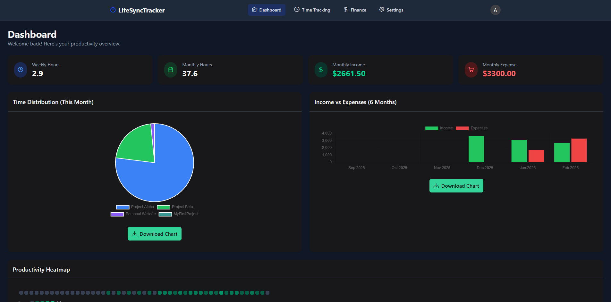

# LifeSync Tracker

A unified web platform for freelancers and individuals to track time spent on specific tasks, manage personal finances (earnings vs. spendings), and visualize productivity and financial health.

[](./screenshots/dashboard.png)

## Features

### Time Tracking Module
- **Project/Task Grouping**: Create projects (e.g., "Company A", "Personal Learning") with optional hourly rates
- **Tags**: Organize work with tags (e.g., "Development", "Meeting", "Planning")
- **Timer**: Start/stop timer with a prominent button, modal for project association and descriptions
- **Manual Entry & Editing**: Add and edit time records manually
- **Employer Reporting**: Filter by project and month, export to PDF/Excel for invoicing

### Finance Tracking Module
- **Transaction Logging**: Track income and expenses with categories
- **Automatic Earning Calculation**: Auto-create income records based on hourly rates
- **Financial Summary**: View total income, expenses, and net balance

### Visualization & Dashboard
- **Time Distribution Chart**: Pie chart showing time per project
- **Financial Flow**: Bar chart comparing income vs. expenses
- **Productivity Heatmap**: Calendar view showing work intensity per day

## Technology Stack

### Frontend
- **Framework**: Angular 21
- **Component Library**: PrimeNG (DataTables, Charts, Inputs, Modals)
- **Styling**: Tailwind CSS (Utility-first styling for layout and responsiveness)
- **State Management**: Angular Signals

### Backend
- **Framework**: .NET 8 (ASP.NET Core Web API)
- **ORM**: Entity Framework Core (EF Core)
- **Authentication**: JWT (JSON Web Token)

### Database
- **Development**: SQLite
- **Production**: PostgreSQL
- **Strategy**: Code-First Migrations via EF Core

## Project Structure

```
LifeSyncTracker/
├── backend/
│   └── LifeSyncTracker.API/
│       ├── Controllers/          # API Controllers
│       ├── Data/                 # DbContext and database configuration
│       ├── Models/
│       │   ├── DTOs/            # Data Transfer Objects
│       │   └── Entities/        # Database entities
│       ├── Services/            # Business logic services
│       │   └── Interfaces/      # Service interfaces
│       ├── Migrations/          # EF Core migrations
│       └── Program.cs           # Application entry point
│
├── frontend/
│   └── src/
│       ├── app/
│       │   ├── core/           # Core services, guards, interceptors
│       │   ├── features/       # Feature modules (auth, dashboard, etc.)
│       │   └── shared/         # Shared components
│       └── environments/       # Environment configurations
│
└── README.md
```

## Getting Started

### Prerequisites
- .NET 8 SDK
- Node.js 20+ and npm
- Angular CLI 21

### Backend Setup

1. Navigate to the backend directory:
   ```bash
   cd backend/LifeSyncTracker.API
   ```

2. Restore dependencies:
   ```bash
   dotnet restore
   ```

3. Apply database migrations:
   ```bash
   dotnet ef database update
   ```

4. Run the backend:
   ```bash
   dotnet run
   ```

   The API will be available at `https://localhost:7001` (or `http://localhost:5000`)

### Frontend Setup

1. Navigate to the frontend directory:
   ```bash
   cd frontend
   ```

2. Install dependencies:
   ```bash
   npm install
   ```

3. Run the development server:
   ```bash
   ng serve
   ```

   The application will be available at `http://localhost:4200`

## API Endpoints

### Authentication
- `POST /api/auth/register` - Register new user
- `POST /api/auth/login` - Login and get JWT token

### Projects
- `GET /api/projects` - Get all projects
- `POST /api/projects` - Create project
- `PUT /api/projects/{id}` - Update project
- `DELETE /api/projects/{id}` - Delete project

### Time Entries
- `GET /api/timeentries` - Get time entries (with filtering)
- `POST /api/timeentries/start` - Start timer
- `POST /api/timeentries/stop` - Stop timer
- `POST /api/timeentries` - Create manual entry
- `PUT /api/timeentries/{id}` - Update entry
- `DELETE /api/timeentries/{id}` - Delete entry

### Transactions
- `GET /api/transactions` - Get transactions (with filtering)
- `POST /api/transactions` - Create transaction
- `PUT /api/transactions/{id}` - Update transaction
- `DELETE /api/transactions/{id}` - Delete transaction
- `GET /api/transactions/categories` - Get categories

### Dashboard
- `GET /api/dashboard` - Get dashboard statistics
- `GET /api/dashboard/time-distribution` - Get time distribution data
- `GET /api/dashboard/monthly-flow` - Get monthly financial flow

## Environment Configuration

### Backend (appsettings.json)
```json
{
  "ConnectionStrings": {
    "DefaultConnection": "Data Source=lifesync.db"
  },
  "Jwt": {
    "Key": "YourSecretKey",
    "Issuer": "LifeSyncTracker",
    "Audience": "LifeSyncTrackerUsers"
  }
}
```

### Frontend (environment.ts)
```typescript
export const environment = {
  production: false,
  apiUrl: 'https://localhost:7001/api'
};
```

## License

This project is licensed under the [MIT License](./LICENSE).
