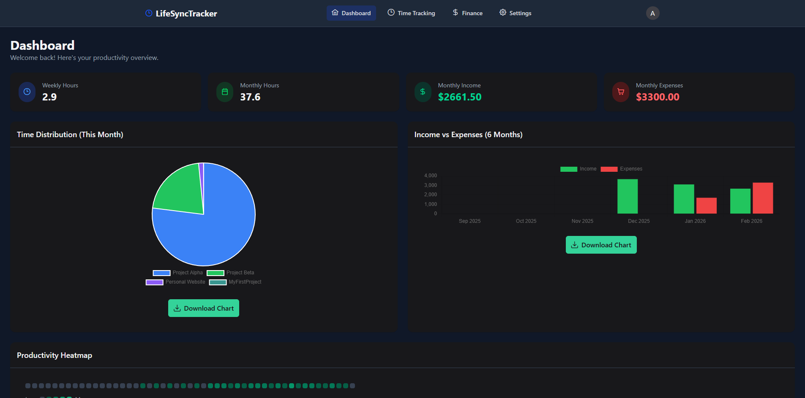

# LifeSync Tracker

A unified web platform for freelancers and individuals to track time spent on specific tasks, manage personal finances (earnings vs. spendings), and visualize productivity and financial health.

[](./screenshots/dashboard.png)

## Features

### Design
- **Calm, data-first UI**: one neutral design system across every page, with light, dark and system themes and no theme flash on load
- **App shell**: collapsible sidebar with a live timer badge, top bar with breadcrumb, timer pill and theme switch, and a bottom tab bar on mobile
- **Consistent components**: dialogs, dropdowns, date pickers, menus, toasts and confirm dialogs all share the same tokens

### Dashboard
- **KPI tiles**: week-over-week deltas with sparklines
- **Cash flow**: 12-month income vs. expenses
- **Time by project**: ranked bar list
- **Activity heatmap**: real hours per day, with streaks
- **Recent activity** feed

### Time Tracking
- **Projects & tags**: group work into projects (with optional hourly rates) and tag it (e.g. "Development", "Meeting")
- **Timer**: start against a project from the page or the top bar; the running timer stays visible everywhere
- **Filters**: period, project and tag, with summary tiles for the selection
- **Entries grouped by day**, with manual entry and editing
- **Monthly report**: preview, then export to PDF/Excel for invoicing

### Finance
- **Transactions**: income and expenses with categories; earnings can be created automatically from hourly rates
- **Period KPIs**: compared with the previous period, plus savings rate
- **Monthly trend** and **spending by category**
- A notice when transactions are in other currencies

### Settings & Profile
- Manage projects, tags and categories; set currency, timezone and theme preferences

## Technology Stack

### Frontend
- **Framework**: Angular 21
- **Component Library**: PrimeNG 21, themed by a custom preset (`core/theme/lifesync-preset.ts`) mapped onto the app's CSS variables
- **Styling**: Tailwind CSS 4, with the light/dark design tokens in `styles.css` exposed through `@theme`
- **Charts**: Chart.js
- **Typography & icons**: Geist font, bundled PrimeIcons
- **State Management**: Angular Signals

### Backend
- **Framework**: .NET 8 (ASP.NET Core Web API)
- **ORM**: Entity Framework Core (EF Core)
- **Authentication**: JWT (JSON Web Token)

### Database
- **PostgreSQL** in both development and production
- **Strategy**: Code-First Migrations via EF Core, applied automatically on startup
- Sensitive fields are encrypted at rest (AES-256-GCM) with HMAC blind-index columns for lookups

## Project Structure

```
LifeSyncTracker/
├── backend/
│   └── LifeSyncTracker.API/
│       ├── Controllers/          # API Controllers
│       ├── Data/                 # DbContext and database configuration
│       ├── Models/
│       │   ├── DTOs/            # Data Transfer Objects
│       │   └── Entities/        # Database entities
│       ├── Services/            # Business logic services
│       │   └── Interfaces/      # Service interfaces
│       ├── Migrations/          # EF Core migrations
│       └── Program.cs           # Application entry point
│
├── frontend/
│   └── src/
│       ├── app/
│       │   ├── core/           # Services, guards, interceptors, theme preset, format utils
│       │   ├── features/       # Pages: auth, dashboard, time-tracking, finance, settings, profile
│       │   └── shared/         # Shell, stat tile, bar list, heatmap calendar, color field
│       └── styles.css          # Design tokens (light/dark)
│       └── environments/       # Environment configurations
│
└── README.md
```

## Getting Started

**See [SETUP.md](./SETUP.md) for the full development and production/hosting guide.**

### Prerequisites
- .NET 8 SDK (or newer, with the .NET 8 runtime installed)
- Node.js 20.19+ / 22.12+ and npm
- Docker (PostgreSQL is required — there is no SQLite fallback)

### Run the whole stack

```bash
cp .env.example .env   # then fill in the keys — see SETUP.md
docker compose up -d --build
```

The app is served at `http://localhost:8088`.

### Run for development (hot reload)

```bash
docker compose -f docker-compose.dev.yml up -d          # Postgres + Mailpit
cd backend/LifeSyncTracker.API && dotnet run            # API on :5555, Swagger at /swagger
cd frontend && npm install && npm start                 # app on :4200
```

Backend secrets (`Jwt:Key`, `Encryption:Key`, the connection string and SMTP settings)
come from user-secrets — the exact commands are in [SETUP.md](./SETUP.md#42-configure-backend-secrets-user-secrets).

## API Endpoints

### Authentication
- `POST /api/auth/register` - Register new user
- `POST /api/auth/login` - Login and get JWT token

### Projects
- `GET /api/projects` - Get all projects
- `POST /api/projects` - Create project
- `PUT /api/projects/{id}` - Update project
- `DELETE /api/projects/{id}` - Delete project

### Time Entries
- `GET /api/timeentries` - Get time entries (with filtering)
- `POST /api/timeentries/start` - Start timer
- `POST /api/timeentries/stop` - Stop timer
- `POST /api/timeentries` - Create manual entry
- `PUT /api/timeentries/{id}` - Update entry
- `DELETE /api/timeentries/{id}` - Delete entry

### Transactions
- `GET /api/transactions` - Get transactions (with filtering)
- `POST /api/transactions` - Create transaction
- `PUT /api/transactions/{id}` - Update transaction
- `DELETE /api/transactions/{id}` - Delete transaction
- `GET /api/transactions/categories` - Get categories

### Dashboard
- `GET /api/dashboard` - Get dashboard statistics
- `GET /api/dashboard/time-distribution` - Get time distribution data
- `GET /api/dashboard/monthly-flow` - Get monthly financial flow

## Environment Configuration

Secrets are never stored in `appsettings.json` — it ships with the sensitive values
blank and the app refuses to start without them.

- **Development**: user-secrets (`dotnet user-secrets set "Jwt:Key" "..."`)
- **Production**: environment variables supplied by `.env` via Docker Compose
  (`Jwt__Key`, `Encryption__Key`, `ConnectionStrings__PostgresConnection`, `Email__*`)

See [.env.example](./.env.example) for the full list and [SETUP.md](./SETUP.md) for how
to generate the keys.

### Frontend
`src/environments/environment.ts` points at `http://localhost:5555/api` for development;
the production build swaps in `environment.prod.ts`, which uses `/api` and relies on the
nginx proxy inside the frontend container.

## License

This project is licensed under the [MIT License](./LICENSE).
